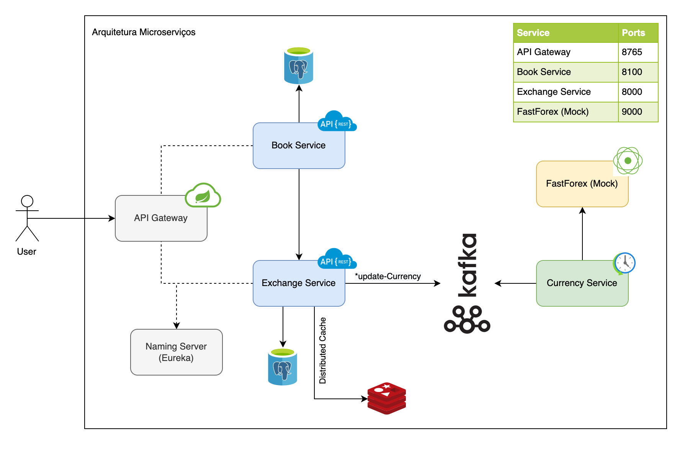

# Projeto Book-Store

Esse projeto se trata de uma POC criada com o intuito de aprofundar meu conhecimentos sobre arquitetura de microserviços.

## Conceitos apricados
* Integração entre serviços utilizando REST
* Integração entre serviços utilizando broker de mensagem kafka
* Criação de scheduler 
* Cache distribuido com Redis
* Criação de API Gateway
* Documentação de APIs com Swagger
* Utilização de naming server para descoberta de serviços
* Conceitos de resiliência e circuit break (Em Andamento)
* Utilização de servidor de configurações (Não iniciado)
* Agregação de Logs e Distributed Tracing (Não iniciado)

## Modulos

#### Book Service
* Mantem informações referente ao catalogo de livros e valor em dolar

#### Exchange Service
* Realiza conversão de um valor em dolar para outra moeda
* Consome informações do tópico kafka update-currency para atualizar cotações

#### Currency Service
* Scheduler que obtém novas cotações para moedas
* Pública informações no tópico update-currency no kafka

#### FastForex Mock
* Mock da api do serviço FastForex para retornar cotações de moedas

#### Naming Server
* Eureka Server para registro e identificação de serviços

#### API Gateway
* Unifica a camada de serviços expondo os endpoints
  * /books/{bookID}/{currency}
  * /exchange/{amount}/{currencyFrom}/{currencyTo}